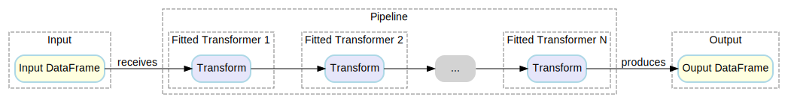

<div align="center">
  <picture>
    
  </picture>
</div>

## Feature Factory

[](https://github.com/habedi/feature-factory/actions/workflows/tests.yml)
[](https://github.com/habedi/feature-factory/actions/workflows/lints.yml)
[](https://codecov.io/gh/habedi/feature-factory)
[](https://www.codefactor.io/repository/github/habedi/feature-factory)
[](https://crates.io/crates/feature-factory)
[](https://docs.rs/feature-factory)
[](https://crates.io/crates/feature-factory)
[](https://github.com/rust-lang/rust/releases/tag/1.83.0)
[](https://github.com/habedi/feature-factory)
[](https://github.com/habedi/feature-factory)

Feature Factory is a feature engineering library for Rust built on top
of [Apache DataFusion](https://datafusion.apache.org/).
It uses DataFusion internally for fast, in-memory data processing.
It is inspired by the [Feature-engine](https://feature-engine.readthedocs.io/en/latest/) Python library and
provides a wide range of components (referred to as transformers) for common feature engineering tasks like imputation,
encoding, discretization, and feature selection.

Feature Factory aims to be feature-rich and provide an API similar to [Scikit-learn](https://scikit-learn.org/stable/),
with the performance benefits of Rust and Apache DataFusion. Feature Factory transformers follow
a [fit-transform paradigm](https://scikit-learn.org/stable/data_transforms.html), where each transformer provides a
constructor, a `fit` method, and a `transform` method. Given an input dataframe, a transformer applies a
transformation to the data and returns a new dataframe.
The library also provides a pipeline API that allows users to chain multiple transformers together to create data
transformation pipelines for feature engineering.

> [!IMPORTANT]
> Feature Factory is currently in the early stage of development. APIs are unstable and may change without notice.
> Inconsistencies in documentation are expected, and not all features have been implemented yet.
> It has not yet been thoroughly tested, benchmarked, or optimized for performance.
> Bug reports, feature requests, and contributions are welcome!

### Features

- **High Performance**: Feature Factory uses Apache DataFusion as the backend data processing engine.
- **Scikit-learn API**: It provides a Scikit-learn-like API which is familiar to most data scientists.
- **Pipeline API**: Users can chain multiple transformers together to build a feature engineering pipeline.
- **Large Set of Transformers**: Currently, Feature Factory includes the following transformers:

| **Task**                                                          | **Transformers**                                                                                                                                                                                                                                                                                                                                                                                                                                                                                                                                                                                                                                                                                                                                         | Status |
|-------------------------------------------------------------------|----------------------------------------------------------------------------------------------------------------------------------------------------------------------------------------------------------------------------------------------------------------------------------------------------------------------------------------------------------------------------------------------------------------------------------------------------------------------------------------------------------------------------------------------------------------------------------------------------------------------------------------------------------------------------------------------------------------------------------------------------------|--------|
| [**Imputation**](src/transformers/imputation.rs)                  | - `MeanMedianImputer`: Replace missing values with the mean (or median).  <br>- `ArbitraryNumberImputer`: Replace missing values with an arbitrary number.  <br>- `EndTailImputer`: Replace missing values with values at distribution tails.  <br>- `CategoricalImputer`: Replace missing values with an arbitrary string or most frequent category.  <br>- `AddMissingIndicator`: Add a binary indicator for missing values.  <br>- `DropMissingData`: Remove rows with missing values.                                                                                                                                                                                                                                                                | Tested |
| [**Categorical Encoding**](src/transformers/categorical.rs)       | - `OneHotEncoder`: Perform one-hot encoding.  <br>- `CountFrequencyEncoder`: Replace categories with their frequencies.  <br>- `OrdinalEncoder`: Replace categories with ordered numbers.  <br>- `MeanEncoder`: Replace categories with target mean.  <br>- `WoEEncoder`: Replace categories with the weight of evidence.  <br>- `RareLabelEncoder`: Group infrequent categories.                                                                                                                                                                                                                                                                                                                                                                        | Tested |
| [**Variable Discretization**](src/transformers/discretization.rs) | - `ArbitraryDiscretizer`: Discretize based on user-defined intervals.  <br>- `EqualFrequencyDiscretizer`: Discretize into equal-frequency bins.  <br>- `EqualWidthDiscretizer`: Discretize into equal-width bins.  <br>- `GeometricWidthDiscretizer`: Discretize into geometric intervals.                                                                                                                                                                                                                                                                                                                                                                                                                                                               | Tested |
| [**Outlier Handling**](src/transformers/outliers.rs)              | - `ArbitraryOutlierCapper`: Cap outliers at user-defined bounds.  <br>- `Winsorizer`: Cap outliers using percentile thresholds.  <br>- `OutlierTrimmer`: Remove outliers from the dataset.                                                                                                                                                                                                                                                                                                                                                                                                                                                                                                                                                               | Tested |
| [**Numerical Transformations**](src/transformers/numerical.rs)    | - `LogTransformer`: Apply logarithmic transformation.  <br>- `LogCpTransformer`: Apply log transformation with a constant.  <br>- `ReciprocalTransformer`: Apply reciprocal transformation.  <br>- `PowerTransformer`: Apply power transformation.  <br>- `BoxCoxTransformer`: Apply Box-Cox transformation.  <br>- `YeoJohnsonTransformer`: Apply Yeo-Johnson transformation.  <br>- `ArcsinTransformer`: Apply arcsin transformation.                                                                                                                                                                                                                                                                                                                  | Tested |
| [**Feature Creation**](src/transformers/feature_creation.rs)      | - `MathFeatures`: Create new features with mathematical operations.  <br>- `RelativeFeatures`: Combine features with reference features.  <br>- `CyclicalFeatures`: Encode cyclical features using sine or cosine.                                                                                                                                                                                                                                                                                                                                                                                                                                                                                                                                       | Tested |
| [**Datetime Features**](src/transformers/datetime.rs)             | - `DatetimeFeatures`: Extract features from datetime values.  <br>- `DatetimeSubtraction`: Compute time differences between datetime values.                                                                                                                                                                                                                                                                                                                                                                                                                                                                                                                                                                                                             | Tested |
| [**Feature Selection**](src/transformers/feature_selection.rs)    | - `DropFeatures`: Drop specific features.<br>- `DropConstantFeatures`: Remove constant and quasi-constant features.<br>- `DropDuplicateFeatures`: Remove duplicate features.<br>- `DropCorrelatedFeatures`: Remove highly correlated features.<br>- `SmartCorrelatedSelection`: Select the best features from correlated groups.<br>-`DropHighPSIFeatures`: Drop features based on Population Stability Index (PSI).<br>- `SelectByInformationValue`: Select features based on information value.<br>- `SelectBySingleFeaturePerformance`: Select features based on univariate estimators.<br>- `SelectByTargetMeanPerformance`: Select features based on target mean encoding.<br>- `MRMR`: Select features using Maximum Relevance Minimum Redundancy. | Tested |

> [!NOTE]
> Status shows whether the module is `Tested` (unit, integration, and documentation tests) and `Benchmarked`.
> Empty status means the module has not yet been tested and benchmarked.

### Installation

```shell
cargo add feature-factory
```

Or add this to your `Cargo.toml`:

```toml
[dependencies]
feature-factory = "0.1"
```

*Feature Factory requires Rust 1.83 or later.*

### Documentation

You can find the latest API documentation at [docs.rs/feature-factory](https://docs.rs/feature-factory).

### Architecture

The main building blocks of Feature Factory are *transformers* and *pipelines*.

#### Transformers

A transformer takes one or more columns from an input DataFrame and creates new columns based on a transformation.
Transformers can be *stateful* or *stateless*:

- A stateful transformer needs to learn one or more parameters from the data during training (via calling `fit`) before
  it can transform the data. A stateful transformer with learned parameters is referred to as a *fitted* transformer.
- A Stateless transformer can directly transform the data without needing to learn any parameters.

All transformers implement the [`Transformer`](src/pipeline.rs) trait, which includes:

| **Method**    | **Description**                                                                                     |
|---------------|-----------------------------------------------------------------------------------------------------|
| `new`         | Creates a new transformer instance. Can accept hyperparameters and column names as input arguments. |
| `fit`         | Learns parameters from data. For stateless transformers this is a no-op.                            |
| `transform`   | Applies the transformation to data. Stateful transformers require calling `fit` first.              |
| `is_stateful` | Returns `true` if the transformer is stateful, otherwise `false`.                                   |

The figure below shows a high-level overview of how a single Feature Factory transformer works:


> [!IMPORTANT]
> In most cases, to avoid data leakage, the data used for training a transformer must not be the same as the data that
> is going to be transformed.

#### Pipelines

A pipeline chains multiple transformers together. Pipelines are created using the [`make_pipeline`](src/pipeline.rs)
macro, which accepts a list of `(name, transformer)` tuples.
Stateful transformers must be fitted before they're used in a pipeline.

The figure below shows a high-level overview of how a Feature Factory pipeline works:



> [!IMPORTANT]
> Currently, to use a stateful transformer in a pipeline, it must be already fitted.

### Examples

Check out the [examples](examples) and [tests](tests) directories for examples of how to use Feature Factory.

### Contributing

See [CONTRIBUTING.md](CONTRIBUTING.md) for details on how to make a contribution.

### Logo

The mascot of this project is named "Weldon the Penguin".
He is a Rustacean penguin who loves to swim in the sea and play video games—and is always ready to help you with your
data.

The logo was created using Gimp, ComfyUI, and a Flux Schnell v2 model.

### Licensing

Feature Factory is available under the terms of either of these licenses:

* MIT License ([LICENSE-MIT](LICENSE-MIT))
* Apache License, Version 2.0 ([LICENSE-APACHE](LICENSE-APACHE))
